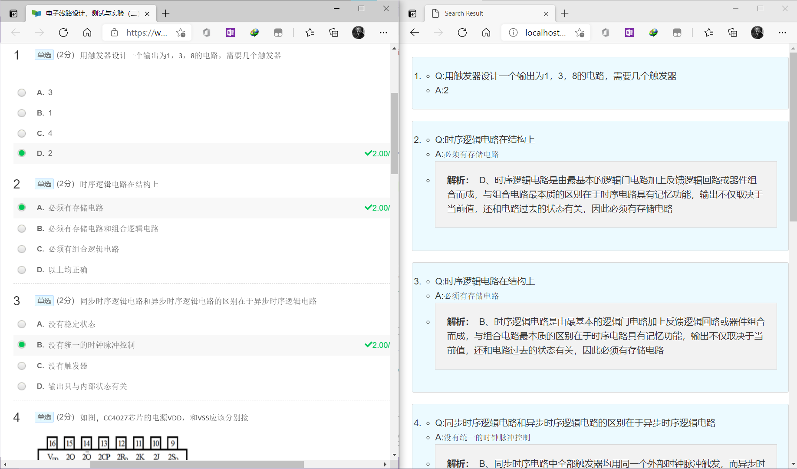

# MoocAnswering
MOOC搜题程序🎉🎉🎉

实际为一个运行在自己电脑上的localhost的服务器程序👀(别问为啥不用能直接网上访问的服务器, 问就是不会😒)

效果:



## HOW TO USE IT:

首先让本地的服务器跑起来

1. Build it from the code

- ***dependency***
  - python3
  - flask
  - flask_cors
  - pandas

  处理完包依赖之后, 直接`python server.py` 即可

2. Download the released package(此方法貌似有些问题, pyinstaller没把环境处理好), 然后点击对应的exe文件, 等待其在命令行中输出Running on http://localhost:80/ 即可

还是建议把py的环境搭起来比较好

然后在对应的MOOC单元测试界面按下`F12` 找到浏览器的DevTools下的Sources界面(也可能会是中文的"资源"),  点击"更多标签页", 新建一个片段, 将名字改为纯英文且中间不含空格的, 把下面的代码粘贴进去

```js
course=$('h4').textContent
unit=$('h2').textContent
problems=document.getElementsByClassName('qaDescription')
queries=[]
for(let i=0;i<problems.length;i++)
{
    query={}
    problem=problems[i]
//     query['caption']=problem.getElementsByTagName('p')[0].innerText.replace(/\s+/,'')
    query['caption']=''
//     query['caption']=problem.getElementsByTagName('p')[0].innerHTML
    temp=problem.getElementsByTagName('p')
    for(let j=0;j<temp.length;j++)
    {
        query['caption']+=temp[j].innerText
    }
    queries.push(query)
}
res_query={'course':course,
            'unit':unit,
            'problems':queries
            }
            
var httpRequest = new XMLHttpRequest();//第一步：创建需要的对象
httpRequest.open('POST', 'http://localhost:80/search', true); //第二步：打开连接/***发送json格式文件必须设置请求头 ；如下 - */
httpRequest.setRequestHeader("Content-type","application/json");//设置请求头 注：post方式必须设置请求头（在建立连接后设置请求头）var obj = { name: 'zhansgan', age: 18 };
httpRequest.send(JSON.stringify(res_query));//发送请求 将json写入send中

console.log('send query successfully')
console.log(queries)
```

将鼠标焦点移到代码段里, 按下`ctrl+Enter` . 然后再新开一个浏览器界面, 输入`localhost` , 点击主页下的`Tool` (也可以直接在浏览器界面输入`localhost\result` )

(简单解释下上面的代码: 对当前你正在做的界面的题目进行爬取, 发送到开启的本地服务器上, 然后服务器程序会进行处理, 合成结果并进行渲染)

## NOW AVAILABLE FOR

- 电子线路设计、测试与实验（一）
- 电子线路设计、测试与实验（二）
- 模拟电子技术基础
- 数字电子技术基础'

## HOW TO CHANGE IT FOR MORE USAGE

获取更多的数据, 利用`source` 文件夹里的mooc_scraping进行爬取往年的可以查到的答案和解析( 这也是最麻烦的部分, 有的课程找不到往年的题目, 所以就.....🤷‍♂️)


## KNOWN BUGS

- 题目显示不全, 没办法让题目里的图片什么的也一起显示出来, 之前有做过将图片也一起爬到数据集里, 但后来服务器程序做匹配时问题太多了, 就实在不想弄了, 将就用吧. Hhhhh (尬笑.jpg)
- 有的题目会存在一个题显示很多次的情况, 这个也没办法解决, 至少我实在想不到什么简单的方法了, 因为它们其实是不完全一样的, 有的是题目答案的位置不一样, 有的是题目本身问的太宽泛, 有很多题都是一样的题目, 但是答案又不一样. 这样的就自己对一下就行啦嘛, 有的用就不错了🤔
- 有些题目会找不到, 应该是因为爬取次数不够, 多运行几次爬虫就好了, 数据会自动合并
